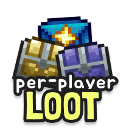

# Terraria Per Player Loot
A [TShock](https://github.com/Pryaxis/TShock) server plugin which makes
naturally spawned loot chests have a separate inventory for each player on your
server. Every player that finds a chest can loot it for themselves, even if it
has been looted by someone else before.

## The Problem
Terraria multiplayer has one big issue - the world you play on is finite, and
there are only so many items and resources to go around. 

When you start a new world to play on with your friends, the few people who
choose to go surface exploring or caving are likely to find most of the chests,
and, as a result, most of the early game loot.

This is not a problem with bosses in Expert or Master mode, because they drop a
loot bag for each player that damaged them, and everyone can be happy.

This plugin makes it much more viable to run large Terraria multiplayer servers,
as there is always an incentive for exploring and caving - the loot is still
there for you to find!

## Installation
1. Copy `PerPlayerLoot.dll` into the `ServerPlugins` directory of your TShock
   server. You can download this from the [GitHub Releases](https://github.com/xxcodianxx/PerPlayerLoot/releases/) of this repository.
3. Start a new world from scratch (yes, this is important, read below) and play!

> [!WARNING]
> If migrating from version `1.0` of the plugin, you need to move `perplayerloot.sqlite`
> from the server root directory to the `tshock` folder. You should see the file as `tshock/perplayerloot.sqlite`.
> If you do not do this, your existing world chests will behave like loot chests!

## How it Works
This plugin aims to not modify the server-side chest state
(`Terraria.Main.chest`) on chest interactions, in the hope that it can be as
least destructive to world save data as possible. 

It works by intercepting the `ChestPlace`, `ChestOpen` and `ChestItem`
packets and spoofing the contents of a loot chest by sending carefully crafted
`ChestItem` packets from an internal database. 

The per-player loot data is written on disk to the SQLite file
`perplayerloot.sqlite` on every world save, alongside a list of all
player-placed chest X and Y coordinates. **If your player-placed chests are not
in this exclusion list, they will be treated as world-generated loot chests.**

This means that In order for player-placed chests to be unaffected, **you need
to have the plugin installed from the very beginning of your server.** If you
install it halfway through a playthrough, all chests in the world will be
treated as if they were generated and will duplicate their inventory contents
for each player.

The only time when the `Main.chest` array is modified is when a loot chest is
possibly broken (which should rarely happen). In that case, the real chest in
`Main.chest` has its items zeroed.

## Debug Commands
- `/ppltoggle` - Toggle the plugin packet hooks globally. **WARNING:** using
  this command is unsupported and can lead to desynchronization of the
  `Main.chest` array and the internal plugin state. 
  
  Debug use only! When in a disabled state, any chests you place will become
  loot chests, and any chest inventory accessed will be its **real inventory**,
  not a per-player instanced one!
